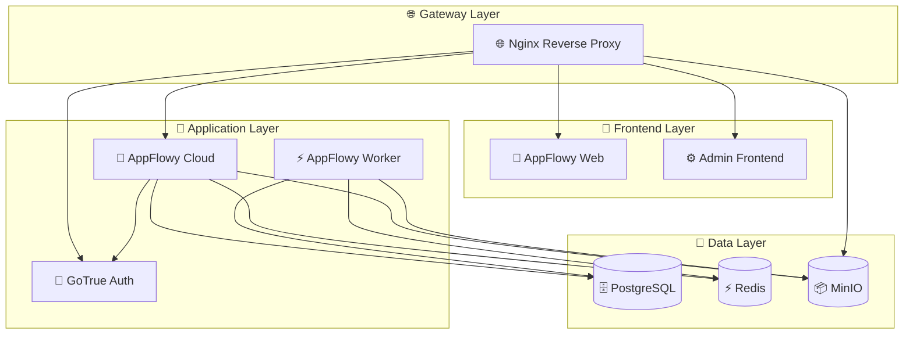

# 🚀 AppFlowy Cloud Kubernetes Deployment

<div align="center">


**Enterprise-grade Kubernetes deployment for AppFlowy Cloud**

*Transform your note-taking experience with a self-hosted, scalable AppFlowy Cloud instance*

🚀 Quick Start • 📖 Documentation • 🛠️ Configuration • 🔧 Troubleshooting

</div>

---

## ✨ What's Inside?

This project delivers a **production-ready Kubernetes deployment** for AppFlowy Cloud, featuring:

- 🏗️ **Complete microservices architecture** with proper service mesh
- 🔐 **Enterprise security** with Kubernetes secrets and RBAC
- 📊 **Monitoring ready** with health checks and resource limits
- 🌐 **Multi-platform support** (minikube, cloud providers, on-premises)
- ⚡ **High availability** with horizontal scaling capabilities
- 🔄 **GitOps compatible** with declarative configurations

## 🎯 Prerequisites

<details>
<summary>📋 System Requirements</summary>

### Minimum Hardware
- **CPU**: 4 cores
- **RAM**: 8GB
- **Storage**: 50GB

### Software Dependencies
| Tool | Version | Purpose |
|------|---------|---------|
| `kubectl` | v1.25+ | Kubernetes CLI |
| `minikube` | v1.30+ | Local development |
| `docker` | v20.10+ | Container runtime |

</details>

### 🛠️ Minikube Setup

```bash
# 🎮 One-liner installation (Linux/macOS)
curl -LO https://storage.googleapis.com/minikube/releases/latest/minikube-linux-amd64
sudo install minikube-linux-amd64 /usr/local/bin/minikube

# 🚀 Launch your cluster
minikube start \
  --memory=8192 \
  --cpus=4 \
  --disk-size=50g \
  --kubernetes-version=v1.28.0

# ⚡ Enable superpowers
minikube addons enable ingress metrics-server storage-provisioner
```

## 🚀 Quick Start

### 1️⃣ Clone & Navigate
```bash
git clone https://github.com/MahmoudKebbi/AppFlowy-Cloud-Kubernetes.git
cd AppFlowy-Cloud-Kubernetes
```

### 2️⃣ Deploy Secrets First! 🔐
```bash
# 🔑 Deploy all secrets in one go
find by_service -name "*-secret.yml" -exec kubectl apply -f {} \;

# ✅ Verify secrets are created
kubectl get secrets
```

### 3️⃣ Launch the Stack 🎯
```bash
# 🗄️ Foundation Layer (Database & Cache)
kubectl apply -f by_service/postgres/ -f by_service/redis/

# 💾 Storage Layer
kubectl apply -f by_service/minio/

# 🔐 Authentication Layer
kubectl apply -f by_service/gotrue/

# 🧠 Application Layer
kubectl apply -f by_service/appflowy-cloud/ \
              -f by_service/appflowy-worker/ \
              -f by_service/appflowy-admin-frontend/

# 🌐 Gateway Layer
kubectl apply -f by_service/nginx/

# 🎨 Optional: Web Frontend & Admin Tools
kubectl apply -f by_service/appflowy-web/ -f by_service/pgladmin/
```

### 4️⃣ Watch the Magic ✨
```bash
# 👀 Monitor deployment progress
watch kubectl get pods,svc

# 🔍 Check specific service health
kubectl get pods -l app=appflowy-cloud -o wide
```

## 🌐 Access Your AppFlowy Cloud

<div align="center">

### 🖥️ **Minikube Access**

</div>

```bash
# 🎯 Get your cluster URL
minikube service nginx --url
```

<div align="center">

| Service | URL Pattern | Description |
|---------|-------------|-------------|
| 🏠 **Main App** | `http://<ip>/` | AppFlowy Web Interface |
| ⚙️ **Admin Panel** | `http://<ip>/console` | Administrative Dashboard |
| 📦 **MinIO Console** | `http://<ip>/minio` | Object Storage Management |
| 🗄️ **PgAdmin** | `http://<ip>/pgadmin` | Database Administration |

</div>

### 🌍 **Cloud/Production Access**

```bash
# 🔍 Find your LoadBalancer IP
kubectl get service nginx -o jsonpath='{.status.loadBalancer.ingress[0].ip}'

# 🌐 Access at: http://<external-ip>/
```

### 🔌 **Port Forwarding (Development)**

```bash
# 🚀 Quick local access
kubectl port-forward service/nginx 8080:80

# 🌐 Visit: http://localhost:8080
```

## 📊 Project Architecture

<div align="center">



</div>

## ⚙️ Advanced Configuration

### 🔧 Environment Customization

<details>
<summary>📧 Enable Email Notifications</summary>

**Update `appflowy-cloud-secret.yml` and `gotrue-secret.yml`:**

```yaml
stringData:
  # 📧 SMTP Configuration
  APPFLOWY_MAILER_SMTP_HOST: smtp.gmail.com
  APPFLOWY_MAILER_SMTP_PORT: "587"
  APPFLOWY_MAILER_SMTP_USERNAME: your-email@gmail.com
  APPFLOWY_MAILER_SMTP_PASSWORD: your-app-password
  APPFLOWY_MAILER_SMTP_TLS_KIND: starttls
  
  # 🔐 GoTrue Email Settings
  GOTRUE_MAILER_AUTOCONFIRM: "false"
  GOTRUE_SMTP_HOST: smtp.gmail.com
  GOTRUE_SMTP_PORT: "587"
  GOTRUE_SMTP_USER: your-email@gmail.com
  GOTRUE_SMTP_PASS: your-app-password
```

</details>

<details>
<summary>🔑 OAuth Integration</summary>

**Add to `gotrue-secret.yml`:**

```yaml
stringData:
  # 🔍 Google OAuth
  GOTRUE_EXTERNAL_GOOGLE_ENABLED: "true"
  GOTRUE_EXTERNAL_GOOGLE_CLIENT_ID: your-google-client-id
  GOTRUE_EXTERNAL_GOOGLE_SECRET: your-google-secret
  GOTRUE_EXTERNAL_GOOGLE_REDIRECT_URI: http://your-domain/auth/v1/callback
  
  # 🐙 GitHub OAuth
  GOTRUE_EXTERNAL_GITHUB_ENABLED: "true"
  GOTRUE_EXTERNAL_GITHUB_CLIENT_ID: your-github-client-id
  GOTRUE_EXTERNAL_GITHUB_SECRET: your-github-secret
```

</details>

<details>
<summary>🤖 AI Features</summary>

**Enable AI in `appflowy-cloud-secret.yml`:**

```yaml
stringData:
  # 🤖 OpenAI Integration
  AI_OPENAI_API_KEY: sk-your-openai-api-key
  AI_OPENAI_ORG_ID: org-your-organization-id
  
  # 🚀 Deploy AI service
  # kubectl apply -f by_service/ai/
```

</details>

### 🌍 Custom Domain Setup

```bash
# 1️⃣ Update DNS records
# Point your-domain.com to your cluster's external IP

# 2️⃣ Update configurations
# Replace localhost/minikube-ip with your domain in secret files

# 3️⃣ Apply SSL certificates (optional)
kubectl create secret tls appflowy-tls \
  --cert=path/to/tls.crt \
  --key=path/to/tls.key
```

## 🔧 Troubleshooting

### 🩺 Health Diagnostics

```bash
# 🔍 Quick health check
kubectl get pods,svc,pvc

# 📊 Resource usage
kubectl top pods

# 🚨 Check failing pods
kubectl get pods --field-selector=status.phase=Failed

# 📝 Detailed pod information
kubectl describe pod <pod-name>

# 📋 View logs
kubectl logs <pod-name> --tail=100 -f
```

### 🚨 Common Issues & Solutions

<details>
<summary>🔴 Pods Stuck in Pending</summary>

**Symptoms:** Pods show `Pending` status
**Solutions:**
```bash
# Check node resources
kubectl describe nodes

# Check storage classes
kubectl get storageclass

# Check persistent volume claims
kubectl get pvc
```

</details>

<details>
<summary>🔴 Database Connection Failures</summary>

**Symptoms:** Apps can't connect to PostgreSQL
**Solutions:**
```bash
# Check PostgreSQL pod
kubectl logs -l app=postgres

# Test connection
kubectl exec -it <postgres-pod> -- psql -U postgres -c '\l'

# Verify service endpoints
kubectl get endpoints postgres
```

</details>

<details>
<summary>🔴 MinIO 503 Errors</summary>

**Symptoms:** MinIO console returns 503 errors
**Solutions:**
```bash
# Remove problematic environment variables from MinIO deployment
# Avoid localhost URLs in MinIO configuration

# Restart MinIO
kubectl rollout restart deployment/minio
```

</details>

### 🔄 Reset & Redeploy

```bash
# 🧹 Clean slate
kubectl delete namespace appflowy --ignore-not-found
kubectl create namespace appflowy

# 🚀 Fresh deployment
kubectl apply -f by_service/ --recursive -n appflowy
```

## 🔒 Production Security Checklist

- [ ] 🔐 **Change all default passwords** in secret files
- [ ] 🌐 **Configure TLS certificates** for HTTPS
- [ ] 🛡️ **Implement NetworkPolicies** for pod isolation
- [ ] 👤 **Setup RBAC** for access control
- [ ] 🔑 **Use external secret management** (Vault, AWS Secrets Manager)
- [ ] 📊 **Enable monitoring** (Prometheus, Grafana)
- [ ] 💾 **Configure backup strategy** for persistent data
- [ ] 🔄 **Setup automated updates** and security patches

## 📚 Learn More

<div align="center">

| Resource | Description |
|----------|-------------|
| [📖 AppFlowy Cloud Docs](https://github.com/AppFlowy-IO/AppFlowy-Cloud) | Official documentation |
| [⚙️ Kubernetes Guide](https://kubernetes.io/docs/) | Kubernetes fundamentals |
| [🎮 Minikube Docs](https://minikube.sigs.k8s.io/docs/) | Local development setup |
| [🔧 kubectl Cheat Sheet](https://kubernetes.io/docs/reference/kubectl/cheatsheet/) | Essential commands |

</div>

## 🤝 Contributing

We ❤️ contributions! Here's how to get involved:

1. 🍴 **Fork** the repository
2. 🌟 **Create** a feature branch: `git checkout -b feature/amazing-feature`
3. 🧪 **Test** your changes on minikube
4. 📝 **Document** new features or configuration options
5. 🚀 **Submit** a pull request

### 🐛 Found a Bug?

[Open an issue](https://github.com/MahmoudKebbi/AppFlowy-Cloud-Kubernetes/issues/new) with:
- 📋 Clear description of the problem
- 🔄 Steps to reproduce
- 💻 Environment details (OS, Kubernetes version, etc.)
- 📝 Relevant logs or screenshots

## ⭐ Show Your Support

If this project helped you, please consider:

- ⭐ **Starring** the repository
- 🐦 **Sharing** with your network
- 🤝 **Contributing** improvements
- 💬 **Joining** our community discussions

---

<div align="center">

**Made with ❤️ for the AppFlowy community**

*Happy note-taking! 📝*

</div>
